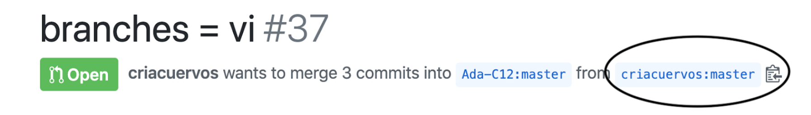

# Slack CLI - Peer Review

## Learning Goals

- Apply code reading skills and code review skills to another codebase under a familiar problem
- Practice navigating someone else's code base
- Practice collaborating over GitHub with a pair
- Practice navigating GitHub's Pull Request feature to clone someone's repo

## Objective

Your Slack CLI needs a code review. You have the code, and a reviewer assigned! Spend time with your reviewer to make sure that **your reviewer pushes git commit(s) to your fork of the `slack-cli-reflection` repo with their code review of your project.**

At the same time, you should be reviewing your pair's Slack CLI project! You should spend time with your pair to make sure that **YOU push git commit(s) to the fork of your pair's `slack-cli-reflection` repo with your code review of their project.**

Follow the activity below to learn more.

Don't forget:

- This is not about seeing someone else's perfect code. This is about practicing reading code and giving meaningful feedback to them. Assume best intention while you review code!
- This is not about defending your code, or thinking that you are defined by your code; also assume best intention!

## Requirements

- Your reviewer must be added as a collaborator to this repo
- Your reviewer must make changes on this file on this repo
    - The changes should be answering the prompts below
    - The changes should be git commits and pushed to this repo

Don't forget: Everyone, including your instructors, are able to see the commit history and who commited what changes at what time!

## Suggested Structure

Because pairs will need to review each other's code, we suggest scheduling ~1 hour of time to collaborate with each other and follow the activity below.

## Peer Review Activity

### Instructions for the Reviewed (You)

1. Read through [Ada's guide for How to give a Code Review](https://github.com/Ada-Developers-Academy/textbook-curriculum/blob/master/03-leadership-and-inclusion/pair-feedback-and-code-reviews.md#how-to-give-a-code-review)
1. Read through the instructions and the Peer Review Table before you get started
1. Coordinate with your pair so that they fill out [the feedback.md file](feedback.md) for your Slack CLI submission, and commit and push those file changes before the due date.

### Instructions for the Reviewer (Your Pair)

1. Read through [Ada's guide for How to give a Code Review](https://github.com/Ada-Developers-Academy/textbook-curriculum/blob/master/03-leadership-and-inclusion/pair-feedback-and-code-reviews.md#how-to-give-a-code-review)
2. Pull in the branch for the student you are reviewing
    - Navigate to the Slack CLI [PR page](https://github.com/Ada-C13/slack-cli/pulls), and then...
        1. click on the pull request name
        2. then click on the name of the submission branch (i.e. criacuervos: master)
        
        

3. Clone this fork on your computer in a different directory then your own forked repository.
      - Don't clone your pair's Slack CLI project into your normal `projects` folder, because then your computer will say that a project named `slack-cli` already exists. Navigate to or make a different folder for this exercise.
4. Complete the feedback rubric defined in `feedback.md` by testing the app and reviewing the code. You should be making changes to your reviewee's `feedback.md` file in their `slack-cli-reflection` repo. Alter the table cells that say `yes/no` to the appropriate `yes` or `no`.

Tip: Use VS Code's extension "Markdown Preview" in order to help you visualize the feedback table.

**At the end of this review, don't forget to commit and push your review. Otherwise, instructors won't be able to see your work.**
